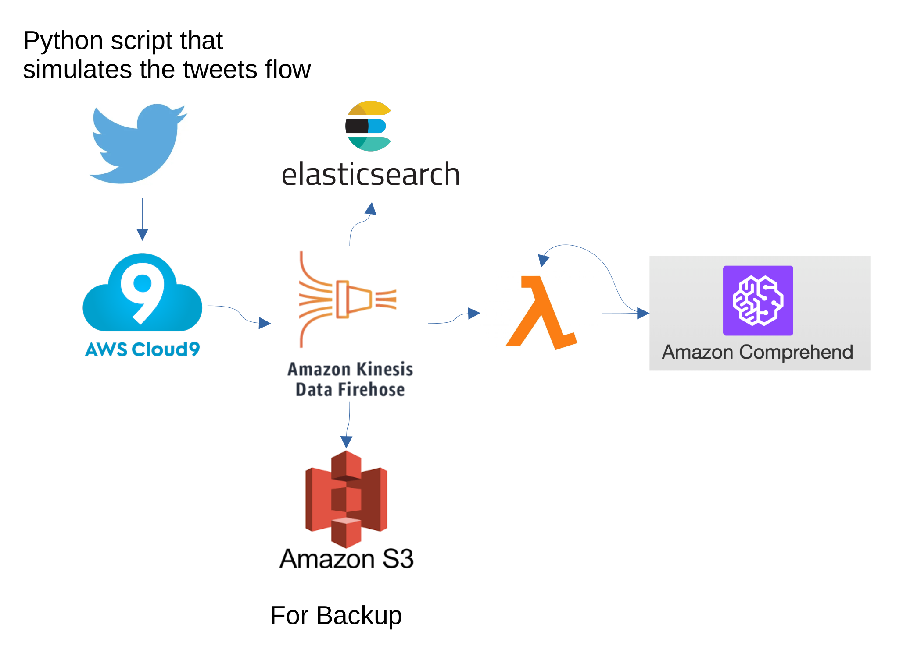
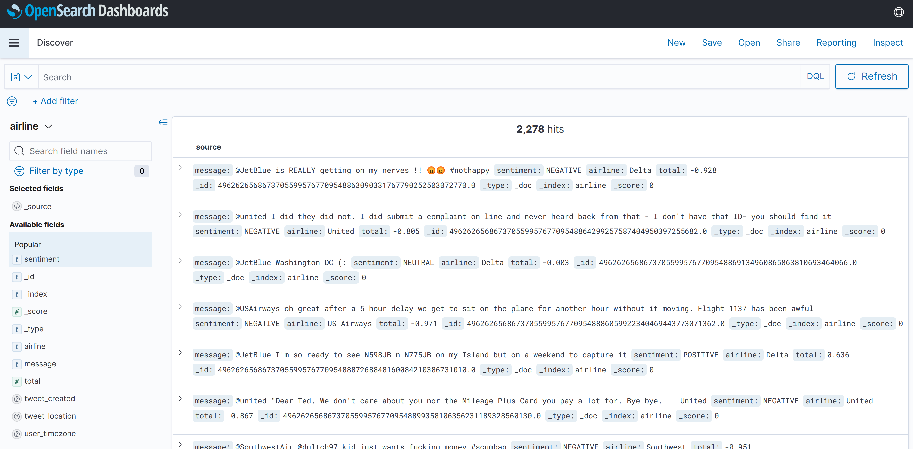
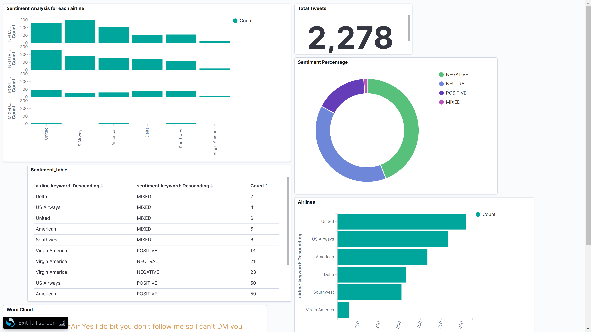
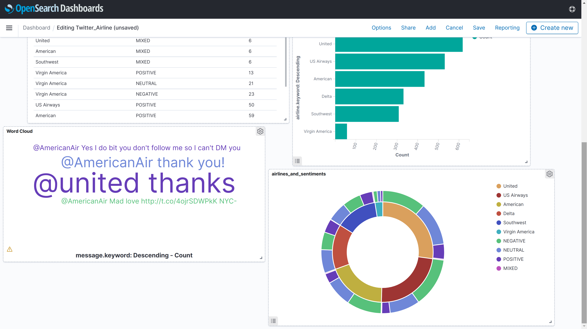

# Data Pipeline: Twitter Sentiment Analysis

## Table of Contents
  - [Introduction](#introduction)
  - [Technologies](#technologies)
  - [Architecture](#architecture)
  - [How it works](#how-it-works)
  - [Notes](#notes)
  - [Screenshots](#screenshots)

---

## Introduction

This project conducts sentiment analysis using AWS on tweets related to airports to assess customer satisfaction.

---

## Technologies

- AWS cloud9
- Amazon Kinesis Data firehose
- AWS lambda
- Amazon comprehend
- ElasticSearch (OpenSearch)
- Amazon S3

---

## Architecture

---

## How it works
- For the sake of simplicity, the flow of tweets is simulated instead of using a developer account on Twitter. The attached 'Data Input' folder can be found for reference.
- Using the AWS Cloud9 IDE, tweets are sent to Kinesis Firehose at specific intervals (based on a specified distribution).
- The data is delivered to Lambda by Firehose, where it is then sent to Amazon Comprehend for sentiment analysis (assuming all the tweets are in English).
- The results of the sentiment analysis are returned and sent to OpenSearch (formerly known as Elasticsearch) for further analysis and visualization.

---

## Notes
- This architecture is intended for educational purposes, and it may not represent the optimal solution.
- Prior to analysis with Amazon Comprehend, the tweets can be passed to Amazon Translate to ensure they are all in English.
- While other services like Athena and Quicksight are available for analysis and visualization, I have chosen to use OpenSearch due to its support by Kinesis Firehose.
- The code for Cloud9 and Lambda is attached for your reference.

---

# Screenshots

